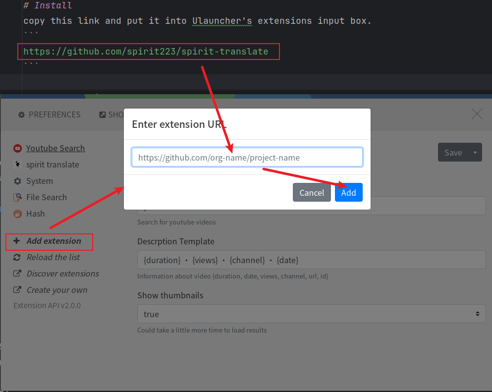
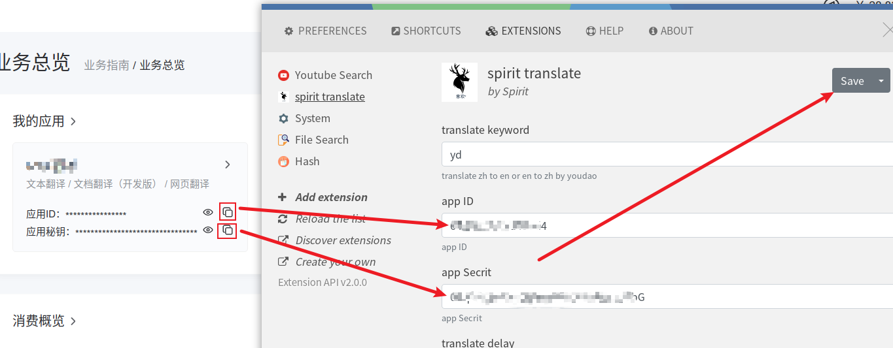

# Spirit-Translate
translate content from english to chinese or from chinese to english

- example1: `yd apple`
- example2: `yd 苹果`

press `enter` to copy the translated result!

# Install
copy this link and put it into Ulauncher's extensions input box.
```
https://github.com/spirit223/spirit-translate
```


# Configure
get youdao api
see [有道翻译API创建指引](https://ai.youdao.com/doc.s#guide)
you need to copy `appId` and `appSecret`.
open Ulaucher's extension page, paste the `appId` and `appSecret`.


here, enjoy it!
# todo
- add delay (Enter the end delay time before performing translation)
- add other language

计时器在事件初始化阶段不初始化， 在有用户输入后再初始化
事件触发时启动计时器，如果计时器未结束用户重新输入则重置计时器，计时器结束用户未输出触发后续翻译动作